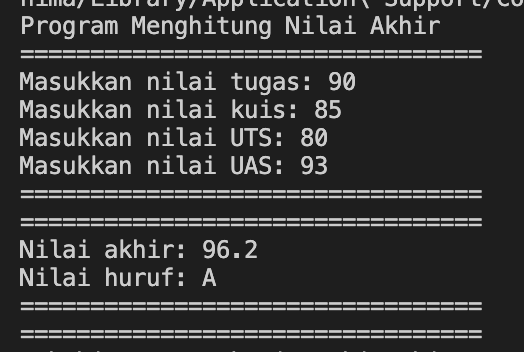
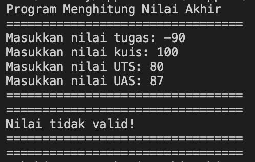
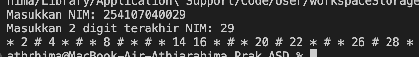

|  | Praktikum Algoritma & Struktur Data |
|--|--|
| NIM |  254107020029 |
| Nama |  Athiarahima Muthmainnah |
| Kelas | TI - 1F |
| Repository | (https://github.com/athia26/PraktikumASD2026.git) |

# #1 KONSEP DASAR PEMROGRAMAN

## 1.1. Pemilihan
Hasil jika memasukkan nilai valid: 

Hasil jika memasukkan nilai tidak valid: 

## 1.2. Pengulangan

Hasil pengulangan dengan angka belakang NIM : 29

