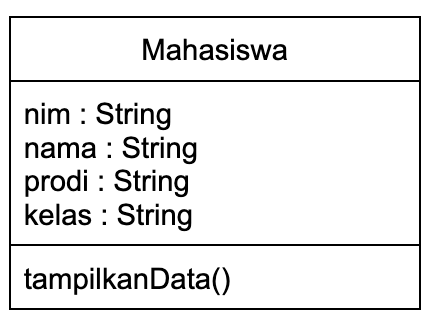
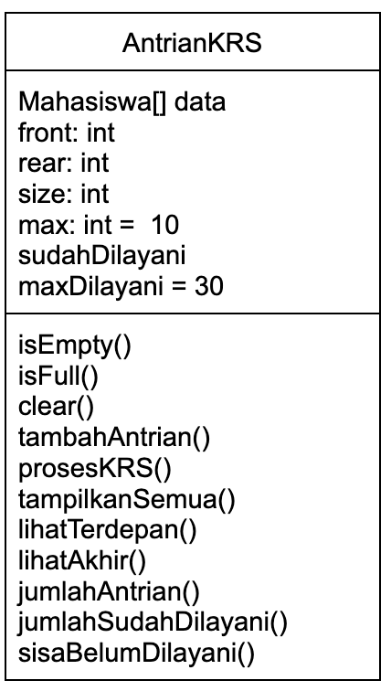

|  | Praktikum Algoritma & Struktur Data |
|--|--|
| NIM |  254107020029 |
| Nama |  Athiarahima Muthmainnah |
| Kelas | TI - 1F |
| Absen | 05 |
| Repository | (https://github.com/athia26/PraktikumASD2026.git) |

# # 10 QUEUE

## 10.1. Praktikum 1: Operasi dasar queue

- Code Program 
    - [Queue.java](Queue.java)
    - [QueueMain.java](QueueMain.java)

### Hasil praktikum 1: 

```java
Masukkan kapasitas queue: 4
----------------------
Masukkan operasi yg diinginkan: 
1. Enqueue
2. Dequeue
3. Print
4. Peek
5. Clear
----------------------
Pilih menu: 1
Masukkan data baru: 15
----------------------
Masukkan operasi yg diinginkan: 
1. Enqueue
2. Dequeue
3. Print
4. Peek
5. Clear
----------------------
Pilih menu: 1
Masukkan data baru: 31
----------------------
Masukkan operasi yg diinginkan: 
1. Enqueue
2. Dequeue
3. Print
4. Peek
5. Clear
----------------------
Pilih menu: 4
Elemen terdepan: 15
----------------------
```


### Pertanyaan Praktikum 1: 
1. Pada konstruktor, mengapa nilai awal atribut front dan rear bernilai -1, sementara atribut size bernilai 0?

- Karena saat queue baru dibuat, queue masih kosong dan belum ada data sama sekali. front = -1 -> menandakan belum ada elemen terdepan. rear = -1 -> menandakan belum ada elemen terakhir. size = 0 -> jumlah elemen dalam queue masih nol. Jadi -1 dipakai sebagai penanda khusus bahwa queue belum terisi. 

2. Pada method enqueue, jelaskan potongan kode berikut!

    ```java
    if(isEmpty()){
        front = rear = 0;
    }
    ```

- Kode ini dijalankan saat queue masih kosong dan akan dimasukkan elemen pertama.

3. Pada method Dequeue, jelaskan maksud dan kegunaan dari potongan kode berikut!

    ```java
    dt = data[front];
    size--;
    ```

- Digunakan untuk mengambil data paling depan dari queue lalu mengurangi jumlah elemen.

4. Pada method print, mengapa pada proses perulangan variabel i tidak dimulai dari 0 (int i=0),
melainkan int i=front?

- Karena elemen pertama queue belum tentu berada di index 0.

5. Perhatikan kembali method print, jelaskan maksud dari potongan kode berikut!

    ```java
    i = (i+1) % max;
    ```

- Digunakan untuk perpindahan index pada circular queue. Agar index bisa kembali ke awal array setelah mencapai index terakhir.

6. Tunjukkan potongan kode program yang merupakan queue overflow!

    ```java
    if (isFull()){
    System.out.println("Queue sudah penuh");
    }
    ```

7. Pada saat terjadi queue overflow dan queue underflow, program tersebut tetap dapat berjalan
dan hanya menampilkan teks informasi. Lakukan modifikasi program sehingga pada saat terjadi
queue overflow dan queue underflow, program dihentikan!

    ```java
    public void enqueue(int dt){
        if (isFull()){
            System.out.println("Queue sudah penuh");
            System.exit(0);
        }
    }

    public int dequeue (){
        int dt = 0;
        if (isEmpty()){
            System.out.println("Queue masih kosong");
            System.exit(0);
        }
    }
    ```


## 10.2. Praktikum 2: Antrian Layanan Akademik

- Code Program 
    - [Mahasiswa.java](Mahasiswa.java)
    - [AntrianLayanan.java](AntrianLayanan.java)
    - [MainLayananSIAKAD.java](mainLayananSIAKAD.java)


### Hasil praktikum 2: 

```java
=== Menu Antrian Layanan Akademik===
1. Tambah mahasiswa ke antrian
2. Layani mahasiswa
3. Lihat mahasiswa terdepan 
4. Lihat semua antrian
5. Jumlah Mahasiswa dalam antrian
6. Keluar
----------------------
Pilih menu: 1
NIM       :123  
Nama      :Andi
Prodi     :TI
Kelas     :1G
Andi berhasil masuk ke antrian

=== Menu Antrian Layanan Akademik===
1. Tambah mahasiswa ke antrian
2. Layani mahasiswa
3. Lihat mahasiswa terdepan 
4. Lihat semua antrian
5. Jumlah Mahasiswa dalam antrian
6. Keluar
----------------------
Pilih menu: 1
NIM       :124
Nama      :Bobi
Prodi     :TI
Kelas     :1A
Bobi berhasil masuk ke antrian

=== Menu Antrian Layanan Akademik===
1. Tambah mahasiswa ke antrian
2. Layani mahasiswa
3. Lihat mahasiswa terdepan 
4. Lihat semua antrian
5. Jumlah Mahasiswa dalam antrian
6. Keluar
----------------------
Pilih menu: 4
Daftar mahasiswa dalam antrian: 
NIM - NAMA - PRODI - KELAS
1.123 - Andi - TI - 1G
2.124 - Bobi - TI - 1A

=== Menu Antrian Layanan Akademik===
1. Tambah mahasiswa ke antrian
2. Layani mahasiswa
3. Lihat mahasiswa terdepan 
4. Lihat semua antrian
5. Jumlah Mahasiswa dalam antrian
6. Keluar
----------------------
Pilih menu: 2
Melayani Mahasiswa: 123 - Andi - TI - 1G

=== Menu Antrian Layanan Akademik===
1. Tambah mahasiswa ke antrian
2. Layani mahasiswa
3. Lihat mahasiswa terdepan 
4. Lihat semua antrian
5. Jumlah Mahasiswa dalam antrian
6. Keluar
----------------------
Pilih menu: 4
Daftar mahasiswa dalam antrian: 
NIM - NAMA - PRODI - KELAS
1.124 - Bobi - TI - 1A

=== Menu Antrian Layanan Akademik===
1. Tambah mahasiswa ke antrian
2. Layani mahasiswa
3. Lihat mahasiswa terdepan 
4. Lihat semua antrian
5. Jumlah Mahasiswa dalam antrian
6. Keluar
----------------------
Pilih menu: 5
Jumlah dalam antrian: 1
```

### Pertanyaan Praktikum 2: 
1. Lakukan modifikasi program dengan menambahkan method baru bernama LihatAkhir pada class
AntrianLayanan yang digunakan untuk mengecek antrian yang berada di posisi belakang. Tambahkan
pula daftar menu 6. Cek Antrian paling belakang pada class LayananAkademikSIAKAD sehingga
method LihatAkhir dapat dipanggil!

```java
public void lihatAkhir(){
        if (isEmpty()){
            System.out.println("Antrian kosong");
        } else{
            System.out.println("Mahasiswa paling belakang: ");
            System.out.println("NIM - NAMA - PRODI - KELAS");
            data[rear].tampilkanData();
        }
    }

```

## 10.3. Tugas Praktikum

### Hasil Tugas Praktikum: 

- Class Diagram:    
    
    

- Code Program 
    - [Mahasiswa.java](Mahasiswa.java)
    - [AntrianKRS.java](AntrianKRS.java)
    - [MainKRS.java](MainKRS.java)


